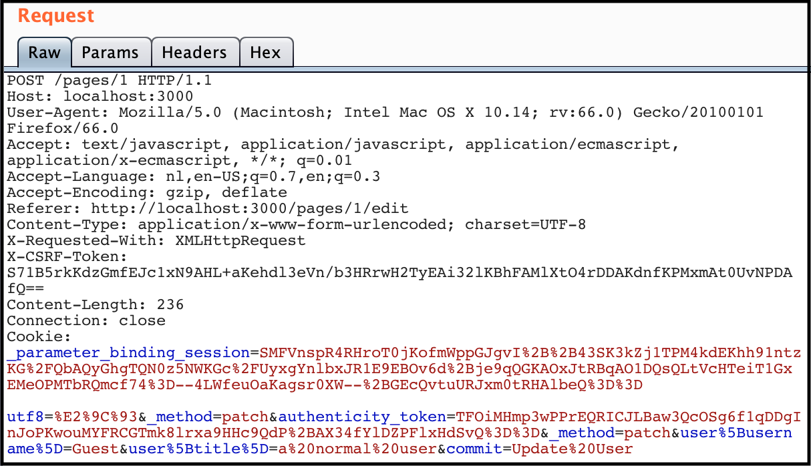
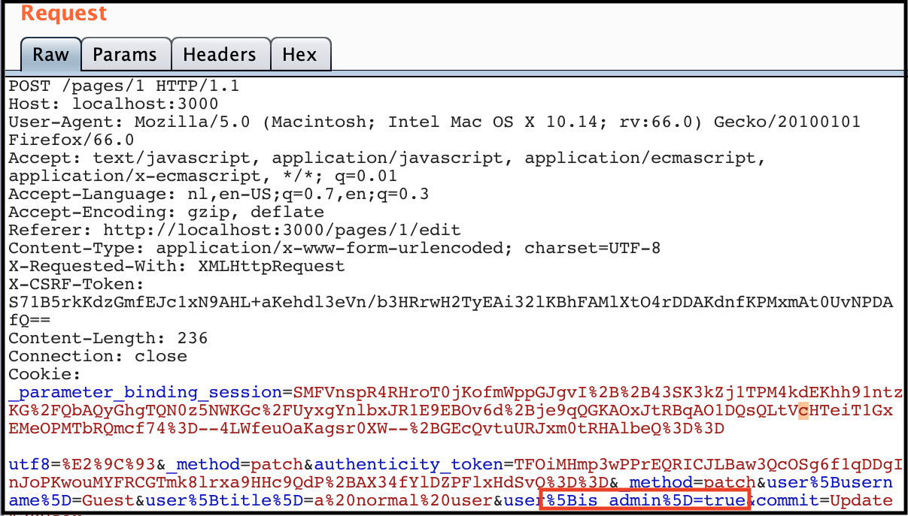
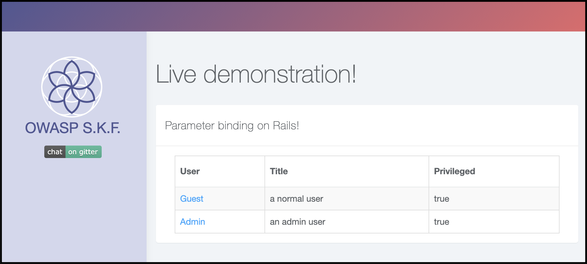

# KBID 147 - Parameter binding

## Running the app

```text
$ sudo docker pull blabla1337/owasp-skf-lab:parameter-binding
```

```text
$ sudo docker run -ti -p 127.0.0.1:3000:3000 blabla1337/owasp-skf-lab:parameter-binding
```


Now that the app is running let's go hacking!


## Running the app Python3

First, make sure python3 and pip are installed on your host machine.
After installation, we go to the folder of the lab we want to practise 
"i.e /skf-labs/XSS/, /skf-labs/jwt-secret/ " and run the following commands:

```
$ pip3 install -r requirements.txt
``

```
$ python3 <labname>
```


 Now that the app is running let's go hacking!



## Reconnaissance

### Step1

Mass assignment is a computer vulnerability where an active record pattern in a web application is abused to modify data items that the user should not normally be allowed to access such as password, granted permissions, or administrator status.

Many web application frameworks offer an active record and object-relational mapping features, where external data in serialization formats is automatically converted on input into internal objects and, in turn, into database record fields. If the framework's interface for that conversion is too permissive and the application designer doesn't mark specific fields as immutable, it is possible to overwrite fields that were never intended to be modified from outside (e.g. admin permissions flag).

In 2012 mass assignment on Ruby on Rails allowed bypassing of mapping restrictions and resulted in proof of concept injection of unauthorized SSH public keys into user accounts at GitHub. 

This attack is mostly really hard to recognize and identify since we can't tell
by simply looking at an application that it might be utilizing an ORM framework.
 
Mostly for each popular programming language there is an ORM available

| Programming language  |  ORM framework |   
|---|---|
| PHP laravel | Eloquent  			|
| Python	 	 |  SQLAlchemy	   |
| Ruby  		 |  ActiveRecord 	|
| C#  			 |  Entity framework|
| Java  		 |  Hibernate 		|

Now, the summerization above just scratches the surface for all the different ORM
that are out there in the wild. For this example we will be exploiting a Ruby stack
with the standard out of the box ActiveRecord ORM.

In order to determine the stack that is running on the webserver we first need to
do active reconnaissance on the webserver and application.

The fingerprinting is out of scope for this excersise but more information about the
topic is found here:


https://www.owasp.org/index.php/Fingerprint_Web_Server_(OTG-INFO-002)
https://www.owasp.org/index.php/Fingerprint_Web_Application_Framework_(OTG-INFO-008)



By inspecting the source code of the target application we find 
that it utlizes an ORM framework to write queries to the database.

```ruby
class PagesController < ApplicationController
    def home
        @user = User.all
      end

      def show
        @user = User.find(params[:id])
      end

      def edit
        @user = User.find(params[:id])
      end
    
      def update
        @user = User.find(params[:id])
        @user.update(user_params)
        redirect_to root_path
      end

      private
      def user_params
        params.require(:user).permit!
      end
end
```

Please take note of the following line of code in the example shown above. This line of code will prove critical for exploiting the parameter binding attack.

```ruby
params.require(:user).permit!
```

To fully understand the attack we need to examine the properties "user" model, which 
looks like this:

```ruby
class CreateUsers < ActiveRecord::Migration[5.2]
  def change
    create_table :users do |t|
      t.string :username
      t.string :title
      t.boolean :is_admin
      t.timestamps
    end
  end
end
```

### Step2

Now, let's examine the target application and determine the objective.

First we find a table with some details about active users on the target application


When we click a user to update his settings we find that the application does not intend us to update "privileged" the property


So, let's recap this important part of the introduction


If the framework's interface for that conversion is too permissive and the application designer doesn't mark specific fields as immutable, it is possible to overwrite fields that were never intended to be modified from outside (e.g. admin permissions flag).



Let's re-examine the following methods:

```ruby
def update
	@user = User.find(params[:id])
	@user.update(user_params)
	redirect_to root_path
end

private
def user_params
	params.require(:user).permit!
end
```

The permit method returns a copy of the parameters object, returning only the permitted keys and values. When creating a new ActiveRecord model, only the permitted attributes are passed into the model.

But, the example above shows no permitted attributes specified. Rather, it just allows for all attributes to be passed to the model. This means that when we add additional parameters to the request that are known in the model. We can abuse the automatic parameter binding  behaviour to update the "is_authorized" property.

A good example would be something like the following:

```ruby
params.require(:user).permit(:username, :title)
```

## Exploitation

### Step1

The exploitation phase is rather simpel with all the information we gathered about the information. However, as said - exploiting this vulnerability in a blackbox environment
can be rather tricky and would ask for a lot of fuzzing and educated guessing in the target application.

Now, let's set up our intercepting proxy and intercept a update request.
The first screenshot shows the request as is without any tampering.




By simply adding the is_authorized property to the request it is passed to the
model and processed on the server-side. 



Thus updating the "Guest" user his authorized status.




## Additional sources

Please refer to the OWASP cheat sheet for a full complete description about parameter binding attacks.






