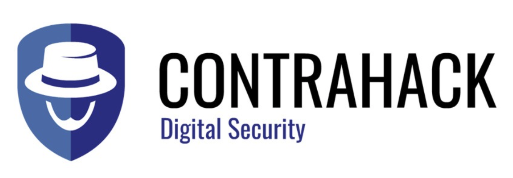
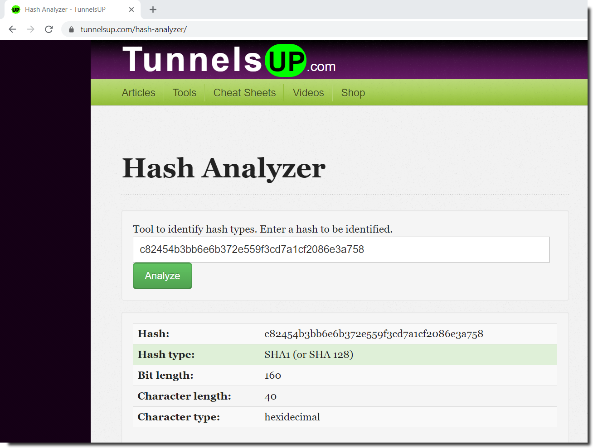
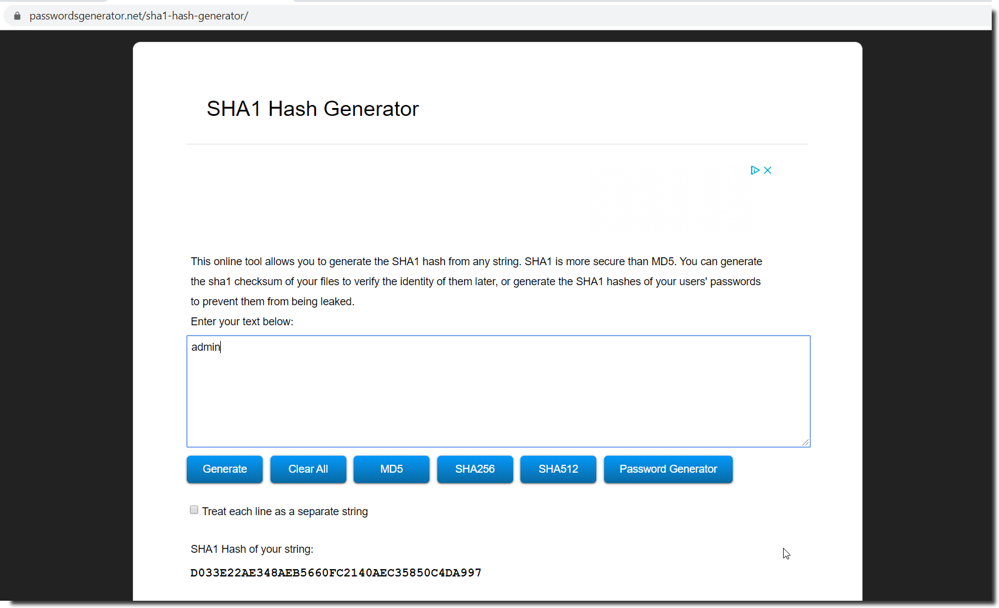
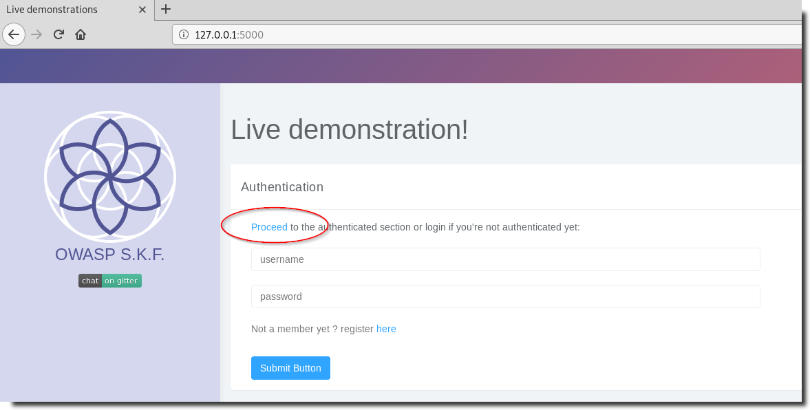

# KBID xxx - Auth-bypass-1

## Running the app

```text
$ sudo docker pull blabla1337/owasp-skf-lab:auth-bypass-1
```

```text
$ sudo docker run -ti -p 127.0.0.1:5000:5000 blabla1337/owasp-skf-lab:auth-bypass-1
```


Now that the app is running let's go hacking!


## Running the app Python3

First, make sure python3 and pip are installed on your host machine.
After installation, we go to the folder of the lab we want to practise 
"i.e /skf-labs/XSS/, /skf-labs/jwt-secret/ " and run the following commands:

```
$ pip3 install -r requirements.txt
``

```
$ python3 <labname>
```


 Now that the app is running let's go hacking!





## Reconnaissance

While most applications require authentication to gain access to private information or to execute tasks, not every authentication method is able to provide adequate security. Negligence, ignorance, or simple understatement of security threats often result in authentication schemes that can be bypassed by simply skipping the log in page and directly calling an internal page that is supposed to be accessed only after authentication has been performed.

In addition, it is often possible to bypass authentication measures by tampering with requests and tricking the application into thinking that the user is already authenticated. This can be accomplished either by modifying the given URL parameter, by manipulating the form, or by counterfeiting sessions.

Obviously, an attacker can tamper with the URL, the form or the session cookie in order to get logged in as a user without knowing the actual credentials.

The goal of this lab is to get logged in as an administrator without knowing his/her credentials

Lets start the application and register a new user


Please note that (for convenience) your password will be reset if the user already exists.
Also note that the password is case sensitive.


Now that we have valid credentials, we can login:


After providing the correct credentials we're logged in:


## Exploitation
We can capture the login in the burpsuite proxy and send it to the repeater. We notice that with every login, the session cookie stays the same. It is high likely that this sessionid is related to our user name:


If we quickly google for this sessionid, we find that the sessionID seems to be corresponding to 'rudy':


We can check whether it is a hash at https://www.tunnelsup.com/hash-analyzer/:



it seems to be a sha1...

Ok, let's lookup the hash of 'admin' at https://passwordsgenerator.net/sha1-hash-generator/



-> D033E22AE348AEB5660FC2140AEC35850C4DA997

Now we can set our sessionID to the sha1 hash of admin:


-> if you don't have a browser cookie manager plugin, you can go to the next step and intercept the request in burp and replace the sessionID there.

Click 'proceed' to go to the authenticated section of the application:




## Additional sources



