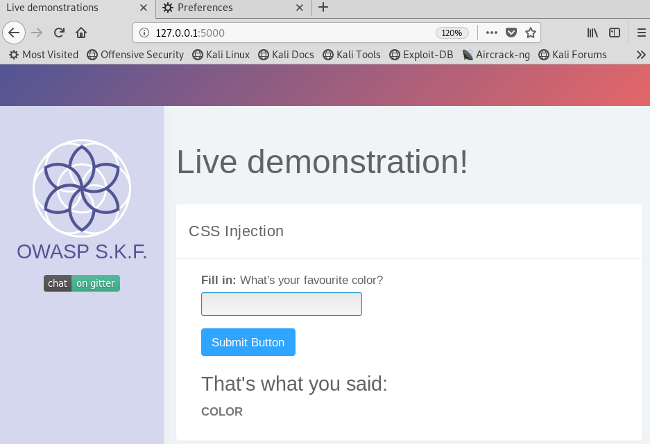
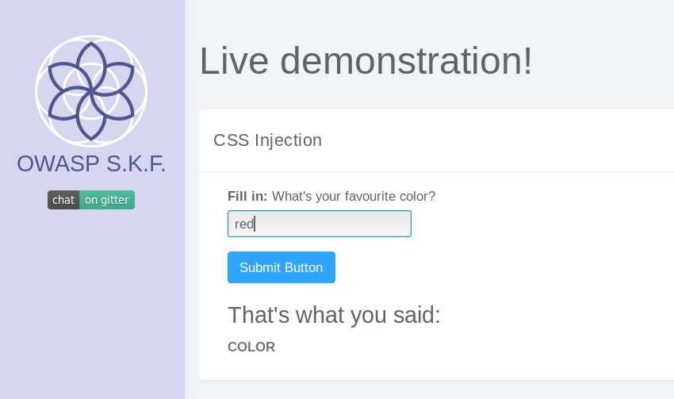
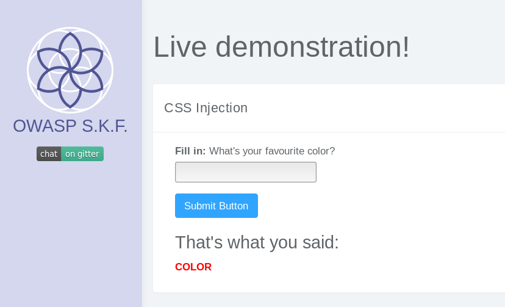
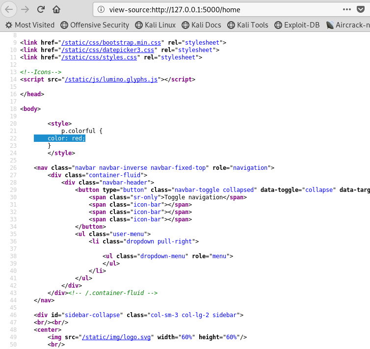
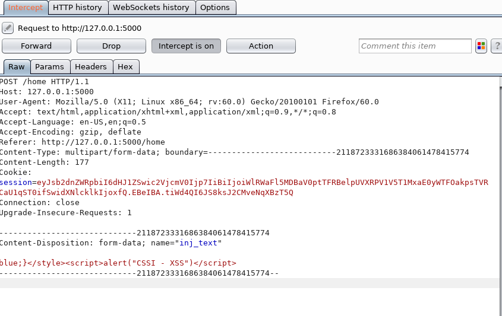
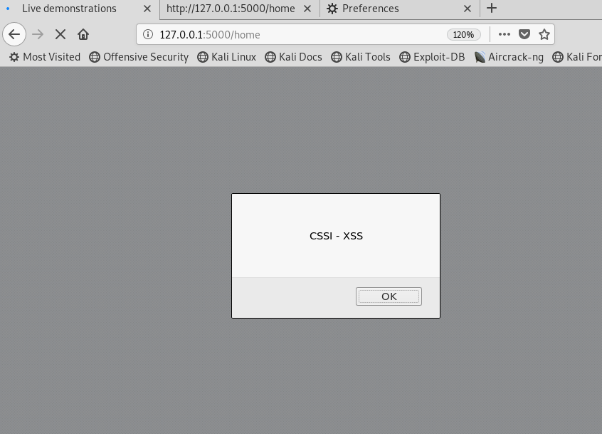

# KBID XXX - CSS Injection 1 (CSSI)

## Running the app

```text
$ sudo docker pull blabla1337/owasp-skf-lab:cssi
```

```text
$ sudo docker run -ti -p 127.0.0.1:5000:5000 blabla1337/owasp-skf-lab:cssi
```


Now that the app is running let's go hacking!



## Reconnaissance

It is very common to use very guessable and weak usernames and passwords because they are easier to use and remember. 
However, this ease for the users becomes a great advantage for potential attackers who are trying to crack the user's credentials. 
It is pretty easy for them to guess or brute force many different credentials until they get to the right ones.

When we start the application we can see that there is a text box that allow you to write a color name.



We can write a color like:



And depending on the color that we chose, this will be the color in the text below:

 

## Exploitation

If we check how the text that we wrote in the text box is later put into the code we can see:



If we try to insert a malicious code that we know it will be inserted in the source code, we can try something like this:



This code should show an alert box or pop up alerting the text "CSSI - XSS".
If we check the website after sending the malicious request:


And goal achieved!

## Additional sources
https://www.owasp.org/index.php/Testing_for_CSS_Injection_(OTG-CLIENT-005)
